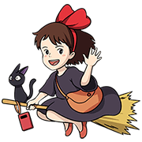
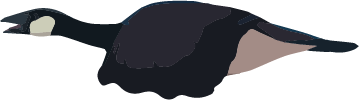
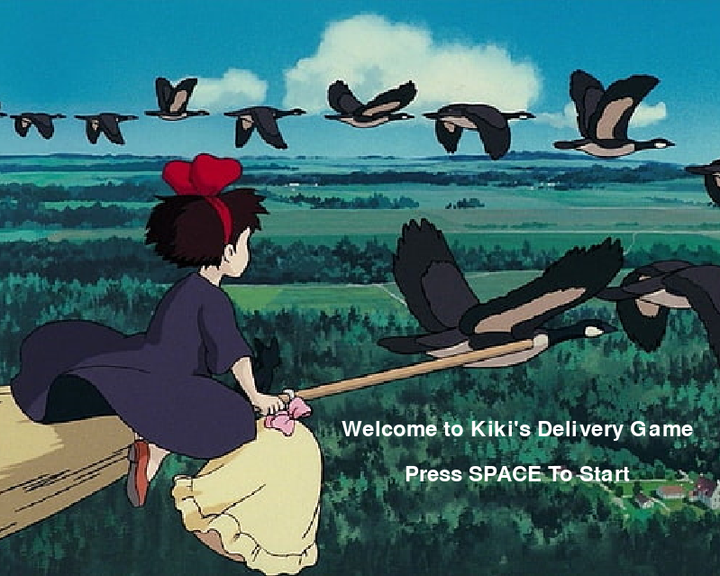
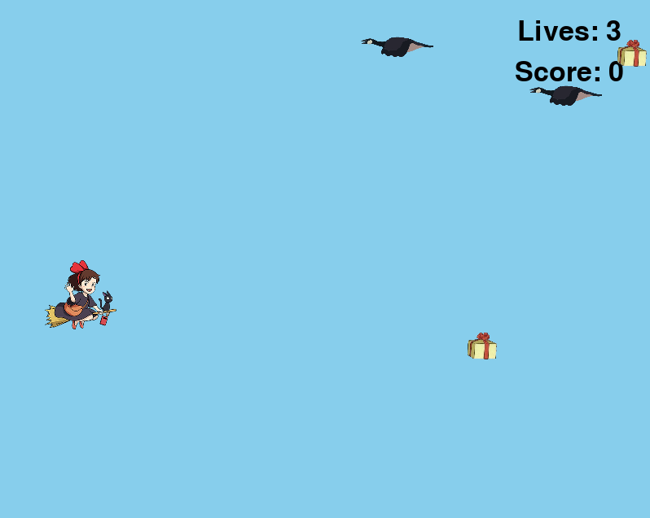
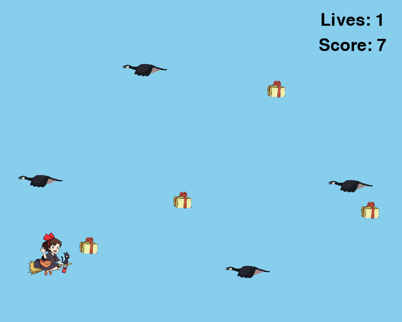
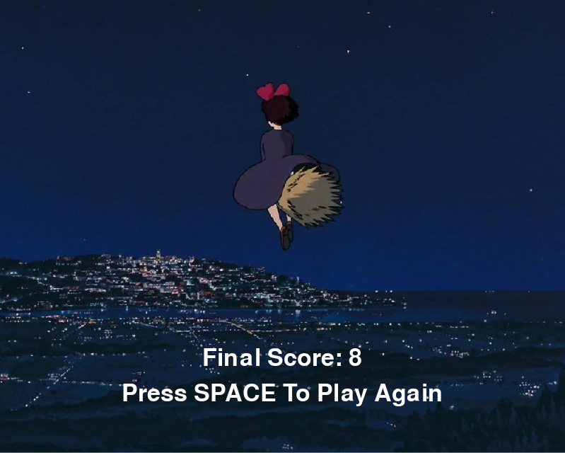

## Kiki's Delivery Game

Welcome to Kiki’s Delivery Game! The goal of this project was to create an interactive program. Inspired by Kiki’s Delivery Service from Studio Ghibli, our team created a game where the player plays as Kiki. Your goal is to collect as many packages as possible while flying and avoiding geese.

## Game Overview

Kiki’s Delivery Game starts with Kiki (the player) on the left side of the screen.

  

The player uses the up and down arrow keys to move Kiki vertically in order to avoid geese and collect packages moving horizontally across the screen.

  

  

The game ends when the player loses all three of their lives. All artwork is obtained from the movie Kiki’s Delivery Service.

### Game Demo

### Gameplay

Our game has three main screens: a start screen, the gameplay screen, and an end screen. At any point in the game, the player can close the window to close the screen.

The start screen welcomes the player and prompts them to press the spacebar to start the game.

  

The game screen starts with the player at the horizontal center of the left side of the screen. The lives (which starts at 3) and score (which starts at 0) are displayed in the top right of the screen.

  

After a short pause, packages and geese are generated at random positions on the right side of the screen and move across the screen towards the player. If the player hits a goose, they lose a life, and if they hit a package, they gain a point towards their score.

  

When the player loses all three of their lives, the game transitions to the end screen, which displays the player’s final score and prompts the player to press the spacebar if they wish to play again.

  

## Installation

A detailed installation guide can be found [here](https://github.com/olincollege/studio-ghibli-game#readme).

To play this game, you must have python and pygame installed. You will also need to download all the files in the [studio-ghibli-game repository](https://github.com/olincollege/studio-ghibli-game). Then, navigate to the repository folder and run the following command in the terminal to start playing:

`python game_model.py`

## About Us

## Attribution

All images were obtained from the movie Kiki's Delivery Service by Studio Ghibli.

We used a [series of tutorials](https://www.youtube.com/watch?v=DHgj5jhMJKg&list=PLjcN1EyupaQm20hlUE11y9y8EY2aXLpnv) by [Coding with Russ](https://www.youtube.com/channel/UCPrRY0S-VzekrJK7I7F4-Mg) to learn some of the basics of pygame when starting this project.
