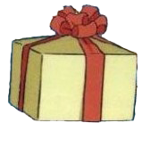

## Kiki's Delivery Game

Welcome to Kiki’s Delivery Game! The goal of this project was to create an interactive program. Inspired by Kiki’s Delivery Service from Studio Ghibli, our team created a game where the player plays as Kiki. Your goal is to collect as many packages as possible while flying and avoiding geese.
 

## Game Overview

Kiki’s Delivery Game starts with Kiki (the player) on the left side of the screen.

  

The player uses the up and down arrow keys to move Kiki vertically in order to avoid geese and collect packages moving horizontally across the screen.

  

  

The game ends when the player loses all three of their lives. All artwork is obtained from the movie Kiki’s Delivery Service.
 

### Gameplay

Our game has three main screens: a start screen, the gameplay screen, and an end screen. At any point in the game, the player can close the window to close the screen.

The start screen welcomes the player and prompts them to press the spacebar to start the game.

  

The game screen starts with the player at the horizontal center of the left side of the screen. The lives (which starts at 3) and score (which starts at 0) are displayed in the top right of the screen.

  

After a short pause, packages and geese are generated at random positions on the right side of the screen and move across the screen towards the player. If the player hits a goose, they lose a life, and if they hit a package, they gain a point towards their score.

  

When the player loses all three of their lives, the game transitions to the end screen, which displays the player’s final score and prompts the player to press the spacebar if they wish to play again.

  

 

### Game Demo

See a full game demo [here](https://youtu.be/DRlvDMA6zSc).
 

## Installation

A detailed installation guide can be found [here](https://github.com/olincollege/studio-ghibli-game/blob/main/README.md).

To play this game, you must have python and pygame installed. You will also need to download all the files in the [studio-ghibli-game repository](https://github.com/olincollege/studio-ghibli-game). Then, navigate to the repository folder and run the following command in the terminal to start playing:

`python game_model.py`
 

## Code Structure

Our code was structured using an MVC format. Using this format, we have a model module, a view module, and a control module. Our control module contains a class that handles collecting input from the user such as pressing the arrow keys or clicking the exit button on pygame. Our view model has a class that handles displaying graphics like sprites and scores on screen. Finally, our model module has the function that actually creates and runs an instance of the game. In addition, we also have an objects module that contains functions and classes for creating and controlling the interactions between sprites. In our main function to run the game, each game screen is controlled by a while loop nested inside of a larger while loop. Each while loop can be switched on or off to control which screen (welcome, gameplay, end) is active. 
 

## Project Takeaways

Doing this project taught us a lot about properly scoping software projects as well as structuring interactive software projects. We could have really easily overscoped this. It’s really easy to get carried about with dialogue, graphics, music, and other aesthetic components when making a game. But ultimately, it was important to us to focus on creating a functional game first and everything else second. This vastly reduced our stress while still giving us a lot of options to easily improve the aesthetics with things like background images. Learning to use the MVC structure was really helpful as a way to think about code and keep everything organized. It helped a lot to be able to quickly organize and find different classes and methods. 
 

## About Us

#### Liv Dawes (they/them)
*Olin College of Engineering '24*

Hi! I'm Liv, an Engineering:Robotics student who likes rock climbing, swimming, traveling, and (of course) studio ghibli.
 

#### Anusha Karandikar (she/her)
*Olin College of Engineering '24*
    
I'm Anusha! I am a Mechanical Enineering student who likes dogs, pizza, and musicals.
 

## Attribution

All images were obtained from the movie Kiki's Delivery Service by Studio Ghibli.

We used a [series of tutorials](https://www.youtube.com/watch?v=DHgj5jhMJKg&list=PLjcN1EyupaQm20hlUE11y9y8EY2aXLpnv) by [Coding with Russ](https://www.youtube.com/channel/UCPrRY0S-VzekrJK7I7F4-Mg) to learn some of the basics of pygame when starting this project.
